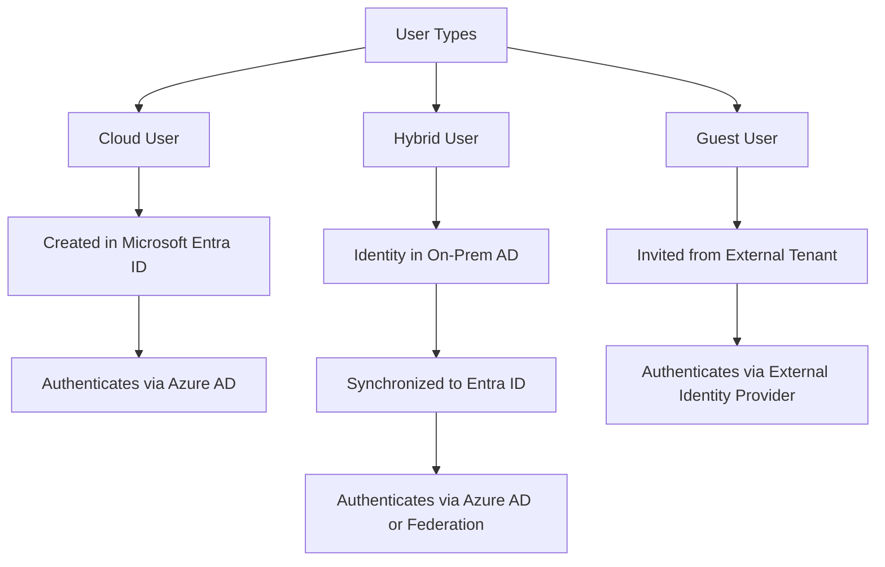
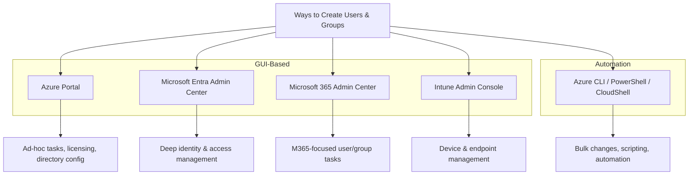
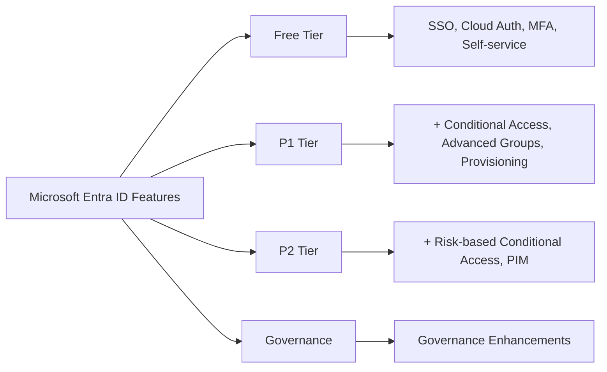
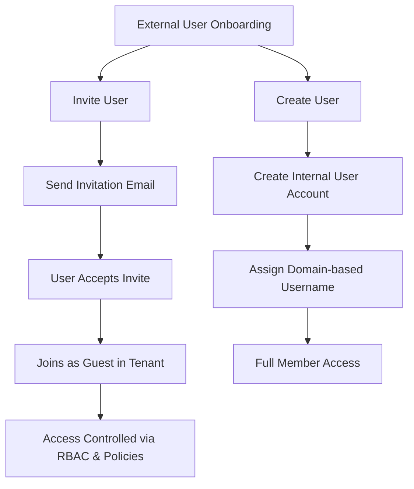

## Domain 1 - Manage Azure identities and governance

---

### 1.1 Manage Microsoft Entra ID users and groups

#### Types of Users
| **User Type**   | **Description**                                                                                       | **Identity Location**                             | **Access Scope**                               | **Typical Use Cases**                                                |
| --------------- | ----------------------------------------------------------------------------------------------------- | ------------------------------------------------- | ---------------------------------------------- | --------------------------------------------------------------------- |
| **Cloud Users** | Fully managed in Microsoft Entra ID (Azure AD) as cloud-native accounts                              | Azure AD / Microsoft Entra ID                    | Access resources within the Azure tenant       | Employees or full members of cloud-only organizations                |
| **Hybrid Users**| Synchronized or federated identities from on-premises Active Directory to Azure AD (hybrid setup)    | On-premises AD + Azure AD                        | Access across on-prem and cloud resources      | Employees in organizations with on-prem AD and Azure integration     |
| **Guest Users** | External users invited to collaborate, mostly external to the tenant; limited guest-level access     | External identity provider or external tenant     | Limited resource access, guest permissions     | Partners, vendors, contractors accessing selected resources          |

**Create users and groups**

| **Portal/Method**                       | **Main Use Case**                                             |
| --------------------------------------- | ------------------------------------------------------------- |
| **Azure Portal**                        | All user/group tasks, access, licensing, directory config     |
| **Microsoft Entra Admin Center**        | Deep identity, access, authentication, roles management       |
| **Microsoft 365 Admin Center**          | Basic user/group management for M365 orgs                     |
| **Azure CLI / PowerShell / CloudShell** | Automation, bulk/batch changes, scripting                     |
| **Intune Admin Console**                | User/group for device, mobility, endpoint management          |

**Hands-on Labs:**
- [ ] [Microsoft Learn Lab: Create users and groups](https://learn.microsoft.com/en-us/training/modules/manage-users-groups-azure-active-directory/)

---

#### **Manage user and group properties**

**Hands-on Labs:**
- [ ] [Lab: Manage group properties](https://learn.microsoft.com/en-us/training/modules/manage-users-groups-azure-active-directory/)

---

#### **Manage licenses in Microsoft Entra ID**

| **Feature**                                             | **Free** | **P1** | **P2** | **Governance** |
| ------------------------------------------------------- | -------- | ------ | ------ | -------------- |
| Single Sign-On (unlimited)                              | ✓        | ✓      | ✓      | ✗              |
| Cloud and Federated authentication                      | ✓        | ✓      | ✓      | ✗              |
| Advanced group management                               | ✗        | ✓      | ✓      | ✓              |
| Self-service account management portal                  | ✓        | ✓      | ✓      | ✓              |
| Multifactor authentication (MFA)                        | ✓        | ✓      | ✓      | ✓              |
| Conditional access                                      | ✗        | ✓      | ✓      | ✓              |
| Risk-based Conditional Access (sign-in risk, user risk) | ✗        | ✗      | ✓      | ✓              |
| Automated user and group provisioning to apps           | ✗        | ✓      | ✓      | ✓              |
| Privileged identity management (PIM)                    | ✗        | ✗      | ✓      | ✓              |

**Hands-on Labs:**
- [ ] [Lab: Assign licenses](https://learn.microsoft.com/en-us/training/modules/manage-users-groups-azure-active-directory/)

---

#### **Manage external users**
Guest users (or B2B users) are external individuals who are invited to access specific resources, such as Microsoft 365 files or SharePoint sites, within the tenant's environment.
Guest users use their own credentials from another directory or identity provider to log in.
They are given restricted, guest-level permissions and can only access the specific resources that have been shared with them.

| **Action**        | **Description**                                                                                     |
| ------------------ | ------------------------------------------------------------------------------------------------- |
| **Create user**    | Adds a new internal user with a domain-based username (e.g., user@yourdomain.com).               |
| **Invite user**    | Sends an email invitation to an external user (guest). They must accept to join as a guest.      |
| **Microsoft Account** | If the invited user’s email isn’t linked to a Microsoft Account, they must create one.        |
| **Purpose**        | Secure onboarding and collaboration for external users in Azure.                                 |

**Hands-on Labs:**
- [ ] [Lab: Manage external users](https://learn.microsoft.com/en-us/training/modules/manage-external-identities/)

---

#### **Configure self-service password reset**

**Hands-on Labs:**
- [ ] [Lab: Configure SSPR](https://learn.microsoft.com/en-us/training/modules/manage-password-reset/)

---

### 1.2 Manage access to Azure resources

#### **Manage built-in Azure roles**

**Hands-on Labs:**
- [ ] [Lab: Assign roles](https://learn.microsoft.com/en-us/training/modules/manage-subscriptions-governance/)

---

#### **Assign roles at different scopes**

**Hands-on Labs:**
- [ ] [Lab: Assign RBAC roles](https://learn.microsoft.com/en-us/training/modules/manage-subscriptions-governance/)

---

#### **Interpret access assignments**

---

### 1.3 Manage Azure subscriptions and governance

#### **Implement and manage Azure Policy**

**Hands-on Labs:**
- [ ] [Lab: Implement Azure Policy](https://learn.microsoft.com/en-us/training/modules/implement-azure-policy/)

---

#### **Configure resource locks**

#### **Apply and manage tags on resources**

#### **Manage resource groups**

#### **Manage subscriptions**

#### **Manage costs by using alerts, budgets, and Advisor recommendations**

#### **Configure management groups**
