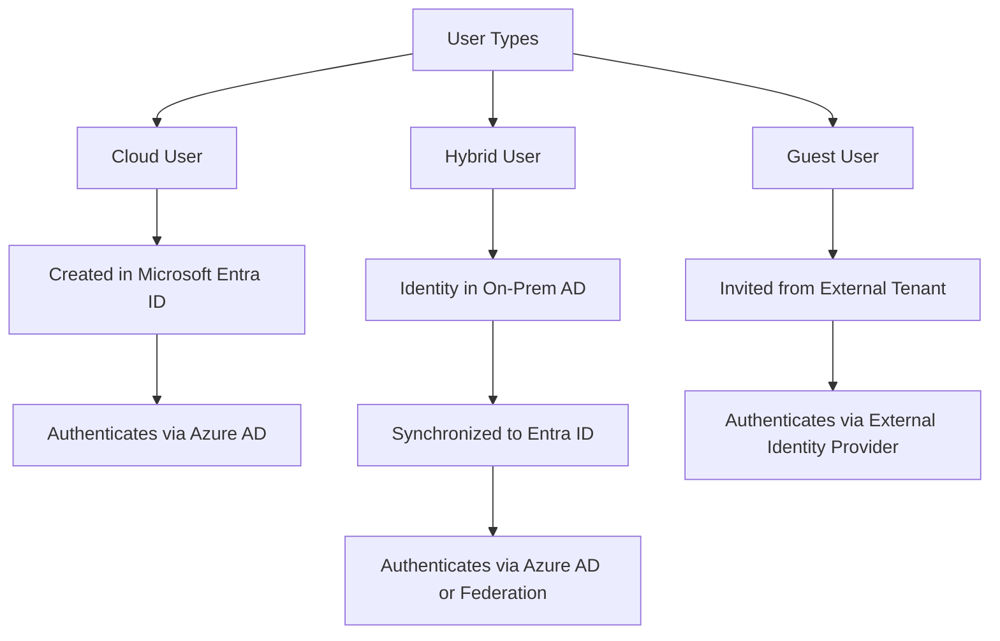

## Domain 1 - Manage Azure identities and governance

---

### 1.1 Manage Microsoft Entra ID users and groups

#### Types of Users
| **User Type**   | **Description**                                                                                       | **Identity Location**                             | **Access Scope**                               | **Typical Use Cases**                                                |
| --------------- | ----------------------------------------------------------------------------------------------------- | ------------------------------------------------- | ---------------------------------------------- | --------------------------------------------------------------------- |
| **Cloud Users** | Fully managed in Microsoft Entra ID (Azure AD) as cloud-native accounts                              | Azure AD / Microsoft Entra ID                    | Access resources within the Azure tenant       | Employees or full members of cloud-only organizations                |
| **Hybrid Users**| Synchronized or federated identities from on-premises Active Directory to Azure AD (hybrid setup)    | On-premises AD + Azure AD                        | Access across on-prem and cloud resources      | Employees in organizations with on-prem AD and Azure integration     |
| **Guest Users** | External users invited to collaborate, mostly external to the tenant; limited guest-level access     | External identity provider or external tenant     | Limited resource access, guest permissions     | Partners, vendors, contractors accessing selected resources          |




#### Methods to create Users and Groups

| **Portal/Method**                       | **Main Use Case**                                             |
| --------------------------------------- | ------------------------------------------------------------- |
| **Azure Portal**                        | All user/group tasks, access, licensing, directory config     |
| **Microsoft Entra Admin Center**        | Deep identity, access, authentication, roles management       |
| **Microsoft 365 Admin Center**          | Basic user/group management for M365 orgs                     |
| **Azure CLI / PowerShell / CloudShell** | Automation, bulk/batch changes, scripting                     |
| **Intune Admin Console**                | User/group for device, mobility, endpoint management          |

```mermaid
flowchart TD
    A[Ways to Create Users & Groups] --> B[Azure Portal]
    A --> C[Microsoft Entra Admin Center]
    A --> D[Microsoft 365 Admin Center]
    A --> E[Azure CLI / PowerShell / CloudShell]
    A --> F[Intune Admin Console]

    B --> B1[Full user/group tasks, licensing, directory config]
    C --> C1[Deep identity & access management]
    D --> D1[Basic M365 user/group management]
    E --> E1[Automation & scripting for bulk changes]
    F --> F1[Device & endpoint management]


**Create users and groups**
**Notes:**
- [ ] Key concepts: Cloud-only vs synced users, group types (Security vs M365), RBAC integration.
- [ ] Roles: Global Admin, User Admin, least privilege principle.

**Visual Learning:**
- [ ] Diagram: Workflow for creating users and assigning roles.
- [ ] Table: Security group vs Microsoft 365 group differences.

**Hands-on Labs:**
- [ ] [Microsoft Learn Lab: Create users and groups](https://learn.microsoft.com/en-us/training/modules/manage-users-groups-azure-active-directory/)

---

#### **Manage user and group properties**
**Notes:**
- [ ] Editable properties: Name, UPN, roles, licenses.
- [ ] Dynamic membership rules for groups.

**Visual Learning:**
- [ ] Diagram: Dynamic group membership flow.

**Hands-on Labs:**
- [ ] [Lab: Manage group properties](https://learn.microsoft.com/en-us/training/modules/manage-users-groups-azure-active-directory/)

---

#### **Manage licenses in Microsoft Entra ID**
**Notes:**
- [ ] Assign licenses to users or groups.
- [ ] License inheritance for group-based assignment.

**Visual Learning:**
- [ ] Table: License assignment options.

**Hands-on Labs:**
- [ ] [Lab: Assign licenses](https://learn.microsoft.com/en-us/training/modules/manage-users-groups-azure-active-directory/)

---

#### **Manage external users**
**Notes:**
- [ ] B2B collaboration, guest accounts, access reviews.

**Visual Learning:**
- [ ] Diagram: External user invitation workflow.

**Hands-on Labs:**
- [ ] [Lab: Manage external users](https://learn.microsoft.com/en-us/training/modules/manage-external-identities/)

---

#### **Configure self-service password reset**
**Notes:**
- [ ] Enable SSPR, authentication methods, policies.

**Visual Learning:**
- [ ] Diagram: SSPR flow.

**Hands-on Labs:**
- [ ] [Lab: Configure SSPR](https://learn.microsoft.com/en-us/training/modules/manage-password-reset/)

---

### 1.2 Manage access to Azure resources

#### **Manage built-in Azure roles**
**Notes:**
- [ ] Common roles: Owner, Contributor, Reader.
- [ ] Custom roles basics.

**Visual Learning:**
- [ ] Table: Built-in roles comparison.

**Hands-on Labs:**
- [ ] [Lab: Assign roles](https://learn.microsoft.com/en-us/training/modules/manage-subscriptions-governance/)

---

#### **Assign roles at different scopes**
**Notes:**
- [ ] Scope hierarchy: Management group > Subscription > Resource group > Resource.

**Visual Learning:**
- [ ] Diagram: RBAC scope hierarchy.

**Hands-on Labs:**
- [ ] [Lab: Assign RBAC roles](https://learn.microsoft.com/en-us/training/modules/manage-subscriptions-governance/)

---

#### **Interpret access assignments**
**Notes:**
- [ ] Check effective permissions using Access Control (IAM).

**Visual Learning:**
- [ ] Screenshot example of IAM blade.

---

### 1.3 Manage Azure subscriptions and governance

#### **Implement and manage Azure Policy**
**Notes:**
- [ ] Policy vs Initiative, compliance reporting.

**Visual Learning:**
- [ ] Diagram: Policy assignment workflow.

**Hands-on Labs:**
- [ ] [Lab: Implement Azure Policy](https://learn.microsoft.com/en-us/training/modules/implement-azure-policy/)

---

#### **Configure resource locks**
**Notes:**
- [ ] Lock types: Read-only vs Delete.

**Visual Learning:**
- [ ] Table: Lock types and effects.

---

#### **Apply and manage tags on resources**
**Notes:**
- [ ] Tagging strategy for cost management.

**Visual Learning:**
- [ ] Diagram: Tag inheritance.

---

#### **Manage resource groups**
**Notes:**
- [ ] Resource group lifecycle, moving resources.

---

#### **Manage subscriptions**
**Notes:**
- [ ] Subscription limits, linking to management groups.

---

#### **Manage costs by using alerts, budgets, and Advisor recommendations**
**Notes:**
- [ ] Cost analysis, budgets, alerts, Advisor tips.

---

#### **Configure management groups**
**Notes:**
- [ ] Hierarchy for governance across subscriptions.

**Visual Learning:**
- [ ] Diagram: Management group hierarchy.

---

## ✅ How to Use This File
- Add **summaries** under Notes as you learn.
- Insert **diagrams/tables** under Visual Learning.
- Link **labs** under Hands-on Labs for quick access.
