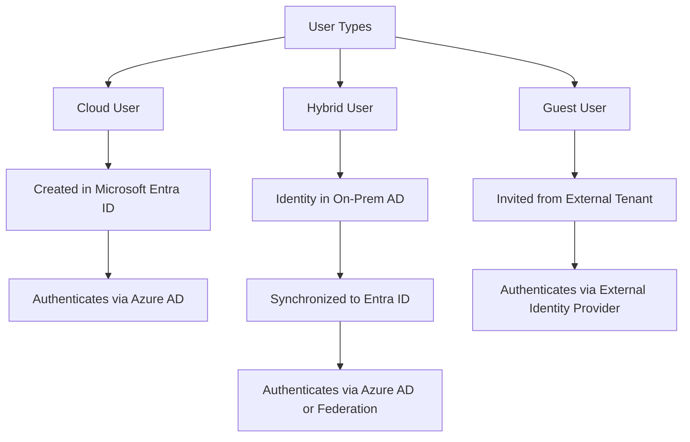
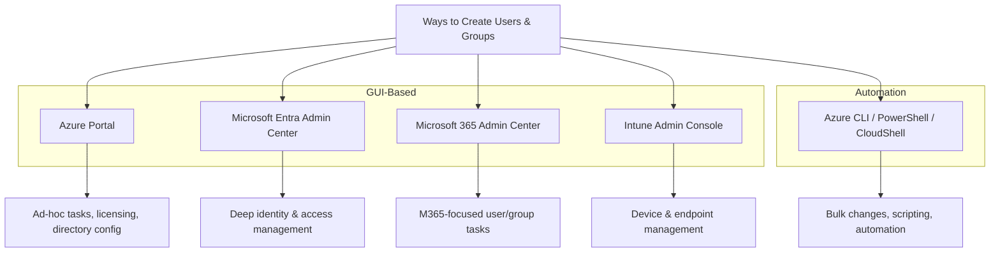
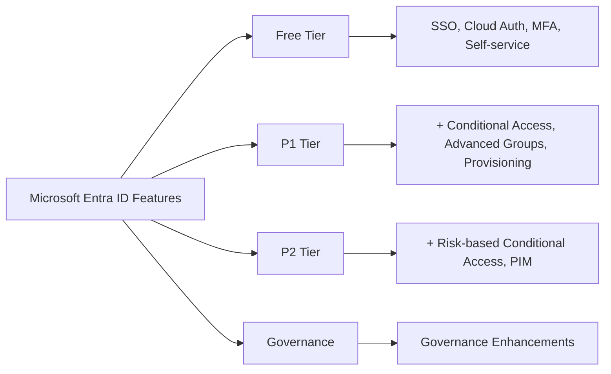
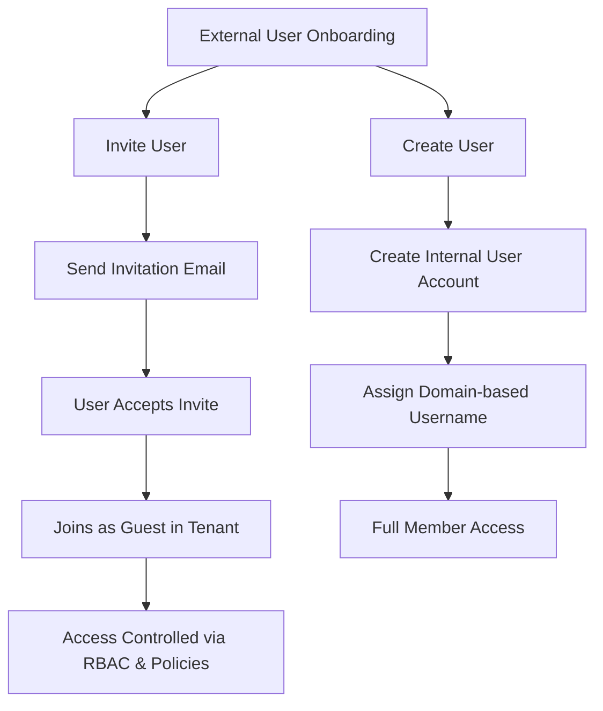

## 1.1 Manage Microsoft Entra ID users and groups

### Create users and groups

| **User Type**   | **Description**                                                                                       | **Identity Location**                             | **Access Scope**                               | **Typical Use Cases**                                                |
| --------------- | ----------------------------------------------------------------------------------------------------- | ------------------------------------------------- | ---------------------------------------------- | --------------------------------------------------------------------- |
| **Cloud Users** | Fully managed in Microsoft Entra ID (Azure AD) as cloud-native accounts                              | Azure AD / Microsoft Entra ID                    | Access resources within the Azure tenant       | Employees or full members of cloud-only organizations                |
| **Hybrid Users**| Synchronized or federated identities from on-premises Active Directory to Azure AD (hybrid setup)    | On-premises AD + Azure AD                        | Access across on-prem and cloud resources      | Employees in organizations with on-prem AD and Azure integration     |
| **Guest Users** | External users invited to collaborate, mostly external to the tenant; limited guest-level access     | External identity provider or external tenant     | Limited resource access, guest permissions     | Partners, vendors, contractors accessing selected resources          |




**Create users and groups**

| **Portal/Method**                       | **Main Use Case**                                             |
| --------------------------------------- | ------------------------------------------------------------- |
| **Azure Portal**                        | All user/group tasks, access, licensing, directory config     |
| **Microsoft Entra Admin Center**        | Deep identity, access, authentication, roles management       |
| **Microsoft 365 Admin Center**          | Basic user/group management for M365 orgs                     |
| **Azure CLI / PowerShell / CloudShell** | Automation, bulk/batch changes, scripting                     |
| **Intune Admin Console**                | User/group for device, mobility, endpoint management          |




#### <em>What to know for this section

The three different types of users are: 
<font color="green">
* cloud
* hybrid
* guest</font>

You need to know what they are, and when you would use them. \
Know the different portals including:
* https://portal.azure.com 
* https://entra.microsoft.com (formerly Azure AD portal)</em>


### Manage user and group properties

Interpret access management.
Be aware of your manage and user group properties.

### Manage licenses in Microsoft Entra ID


| **Feature**                                             | **Free** | **P1** | **P2** | **Governance** |
| ------------------------------------------------------- | -------- | ------ | ------ | -------------- |
| Single Sign-On (unlimited)                              | ✓        | ✓      | ✓      | ✗              |
| Cloud and Federated authentication                      | ✓        | ✓      | ✓      | ✗              |
| Advanced group management                               | ✗        | ✓      | ✓      | ✓              |
| Self-service account management portal                  | ✓        | ✓      | ✓      | ✓              |
| Multifactor authentication (MFA)                        | ✓        | ✓      | ✓      | ✓              |
| Conditional access                                      | ✗        | ✓      | ✓      | ✓              |
| Risk-based Conditional Access (sign-in risk, user risk) | ✗        | ✗      | ✓      | ✓              |
| Automated user and group provisioning to apps           | ✗        | ✓      | ✓      | ✓              |
| Privileged identity management (PIM)                    | ✗        | ✗      | ✓      | ✓              |




#### <em>What to know for this section

Entra has different licenses, know the difference between these licenses. 

Example: Privileged Identity Management (PIM) is a service in Microsoft Entra ID that enables you to manage, control, and monitor access to important resources in your organization. 

When we think about PIM and identity protection, that means you’ll need a P2 license. 

Example 2: Self-service password reset means you need a P1 license.</em>

### Manage external users

Guest users (or B2B users) are external individuals who are invited to access specific resources, such as Microsoft 365 files or SharePoint sites, within the tenant's environment.
Guest users use their own credentials from another directory or identity provider to log in.
They are given restricted, guest-level permissions and can only access the specific resources that have been shared with them.

| **Action**        | **Description**                                                                                     |
| ------------------ | ------------------------------------------------------------------------------------------------- |
| **Create user**    | Adds a new internal user with a domain-based username (e.g., user@yourdomain.com).               |
| **Invite user**    | Sends an email invitation to an external user (guest). They must accept to join as a guest.      |
| **Microsoft Account** | If the invited user’s email isn’t linked to a Microsoft Account, they must create one.        |
| **Purpose**        | Secure onboarding and collaboration for external users in Azure.                                 |



#### <em>What to know for this section

* Know external users. 

* When you invite a guest, what happens with that guest account? \
The guest receives an email with a link to accept the invitation. \
After acceptance, they can access resources based on assigned permissions.

* How do you invite a guest? 
    + Azure Portal (Go to Microsoft Entra ID → Users → New guest user)

    + PowerShell 
    ```
    PowerShellConnect-AzureADNew-AzureADMSInvitation -InvitedUserEmailAddress "guest@example.com" `  -InviteRedirectUrl "https://myapps.microsoft.com" `  -SendInvitationMessage $trueShow more lines
    ```

    + Microsoft Graph API (Use POST /invitations endpoint for automation.)

* What is considered a guest? \
Anybody that’s not part of your tenant is a guest. 

* You’ll see questions where they might ask you about giving a customer access—know that you invite them. \

* Once you invite those guests, how do you manage them?</em>

### Configure self-service password reset

#### <em>What to know for this section

Finally, be aware of the self-service password reset.
Requires a P1 license (not P2—hint, trick question).</em>

[Lab 01: Manage Microsoft Entra ID Identities](https://github.com/sandtiger76/az-104-study-journey/blob/main/labs/Instructions/Labs/LAB_01-Manage_Entra_ID_Identities.md)

## 1.2 Manage access to Azure resources

### Manage built-in Azure roles

#### <em>What to know for this section

Know the built-in roles: User Access Administrator, Contributor, and Owner.
These are the three roles you’ll see on the exam.
Understand scenarios: if Bob needs to create something, does he need Owner or Contributor?
If he needs to delete or give someone else access, know the differences.
Be aware that there are custom roles you can create using JSON templates.</em>

### Assign roles at different scopes

#### <em>What to know for this section

One of the big ones: scoping. Also called hierarchy.
Know at what levels you can scope permissions: management group, subscription, resource group, or role.
Scoping applies to permissions and policies.
All scopes are inheritable, and you cannot break inheritance.</em>

### Interpret access assignments

#### <em>What to know for this section

Interpret access management.
Know the difference between Entra roles (administrator-type roles) and Azure roles (resource-type roles).
Be aware of scoping for both.</em>

[Lab 02a: Manage Subscriptions and RBAC](https://github.com/sandtiger76/az-104-study-journey/blob/main/labs/Instructions/Labs/LAB_02a_Manage_Subscriptions_and_RBAC_Entra.md) 


## 1.3 Manage Azure subscriptions and governance

### Implement and manage Azure Policy

#### <em>What to know for this section

Policies are about scoping.
Know the difference between a policy and an initiative definition:

Policy = single
Initiative definition = grouping of policies


These show up in governance and compliance questions.</em>

### Configure resource locks

#### <em>What to know for this section

Two resource locks: Delete and ReadOnly.
Know what happens with each.</em>

### Apply and manage tags on resources

#### <em>What to know for this section

Be aware of tagging.
Tagging is critical for organization and metadata.</em>

### Manage resource groups

#### <em>What to know for this section

Resource groups are like containers.
They cannot be nested—Azure has a flat structure.
All resources must be part of a resource group.
You can move resources between resource groups.
Resource groups can span multiple regions.</em>

### Manage subscriptions

#### <em>What to know for this section

Subscriptions are your billing capability.
Know the different types of subscriptions and when to use them.
Without a subscription, you cannot build a resource.</em>

### Manage costs by using alerts, budgets, and Advisor recommendations

#### <em>What to know for this section

Understand cost optimization tools.
You might get questions about creating a budget—part of cost management.</em>

### Configure management groups

#### <em>What to know for this section

Management groups are for managing multiple subscriptions.
Great for security and policy capability.
Would you use a management group for one subscription? No.</em>

[Lab 02b: Manage Governance via Azure Policy](https://github.com/sandtiger76/az-104-study-journey/blob/main/labs/Instructions/Labs/LAB_02b-Manage_Governance_via_Azure_Policy.md)
