# Manage Azure Identities and Governance (AZ-104)

### “Identity First, Access Next.”

Identity First → Enable Managed Identity on the resource (VM, Function, etc.). \
Access Next → Assign RBAC role to that identity on the target resource (Resource Group, Storage, etc.).

If you see a question about a resource needing to manage other resources:

Enable Managed Identity.
Grant permissions via RBAC.

**3-Step Checklist**

### ✔ AZ-104 Identity Checklist
1. **Enable Managed Identity**  
   On the resource (VM, Function, App Service) that needs access.

2. **Assign RBAC Role**  
   Grant the identity the correct role (e.g., Contributor, Reader) on the target resource or resource group.

3. **Verify Scope**  
   Ensure the role assignment is at the right level (Resource Group, Subscription, or Resource).

```mermaid
flowchart TD
    A[TD-VM1 🐬 <br/> Enable Managed Identity] --> B["Assign RBAC Role <br/> (Contributor)"]
    B --> C[TD-RG1 🌊 <br/> Resource Group]
```

