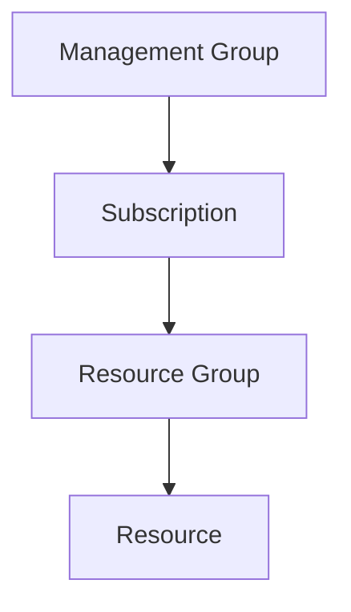
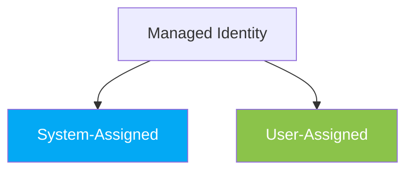
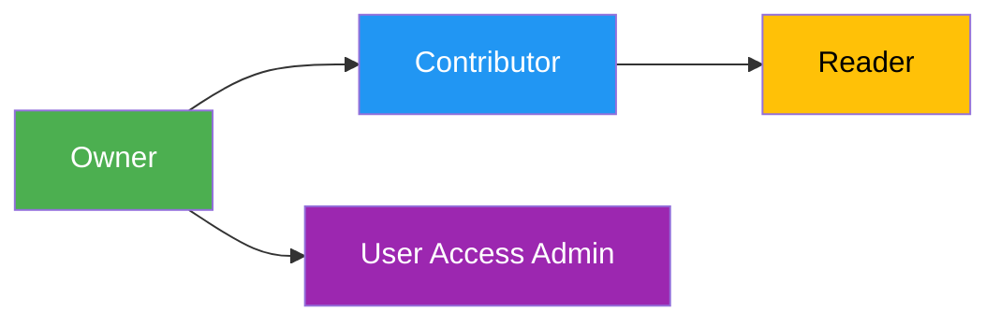
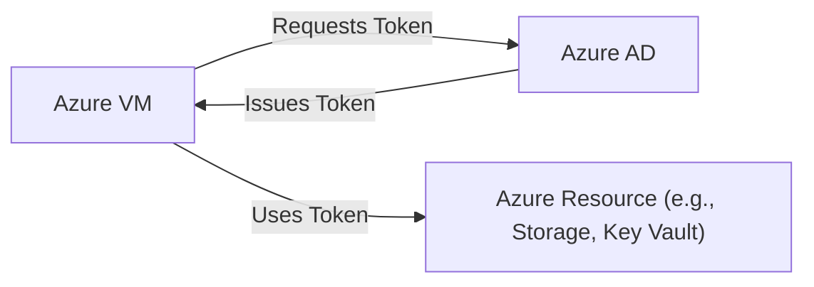
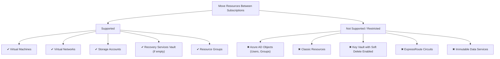

# ✅ AZ-104 Identity & Governance Cheat Sheet

---

## 🌐 Core Concepts
- **Azure Subscription**: Billing & resource container.
- **Resource Group**: Logical grouping for resources with shared lifecycle.
- **Managed Identity**: Secure identity for Azure resources to access other resources without credentials.
- **RBAC**: Role-Based Access Control for permissions at different scopes.

---

## 🏗 Diagram 1: RBAC Scope Hierarchy


## 🔐 Mermaid Diagram 2: Managed Identity Types



- **System-Assigned**: Tied to one resource, lifecycle = resource lifecycle.
- **User-Assigned**: Independent resource, reusable across multiple resources.

## 🛡 Mermaid Diagram 3: RBAC Role Permissions



## 🛡 RBAC Role Cheat Sheet

RolePermissionsOwnerFull access + manage RBACContributorFull resource access (NO RBAC changes)ReaderView resources onlyUser Access AdminManage RBAC only (NO resource changes)

## ✅ Common Exam Patterns

- If a resource needs to manage other resources → Enable Managed Identity first, then assign RBAC.
- RBAC roles inherit downward (assign at RG → applies to resources inside).
- Use system-assigned identity for simplicity unless sharing identity across resources.


## 🔑 Key CLI Commands
Enable Managed Identity on VM:
```
az vm identity assign --name TD-VM1 --resource-group TD-RG1
```

Assign RBAC Role:
```
az role assignment create --assignee <VM-Identity-ID> --role Contributor --scope /subscriptions/<sub-id>/resourceGroups/TD-RG1
```

List Role Assignments:
```
az role assignment list --scope /subscriptions/<sub-id>/resourceGroups/TD-RG1
```

🎯 Memory Hooks

- Dolphin Dive: Identity first, then permissions.
- Hierarchy Ladder: MG → Subscription → RG → Resource.
- RBAC Roles: Owner > Contributor > Reader | Access Admin (side branch).


🔥 Pro Tip for Exam:
If the question mentions “services running on VM should manage resources”, the FIRST step is Enable Managed Identity, NOT RBAC.


## Questions:

### Question 1:

What should you do first to allow the **virtual machine** TD-VM1 to manage resources in the **resource group** TD-RG1 using its identity?

**Answer**:
Enable the Managed Identity on TD-VM1.

**Explanation**:
You need an identity for the VM before assigning RBAC roles, so enabling **Managed Identity** is the first step.




**Explanation**
- The VM asks Azure AD for a token using its Managed Identity.
- Azure AD verifies the identity and gives back a token.
- The VM uses that token to securely access Azure resources without passwords or secrets.


**Quick Analogy**
Think of Managed Identity like a company badge:
- Your VM is an employee.
- Azure AD is the security desk.
- The badge (Managed Identity) lets the VM walk into other secure rooms (Storage, Key Vault) without needing to remember a password.
  
### Question 2:
Which Azure resources can you move between subscriptions?

**Answer**
- Virtual machine
- Virtual network
- Storage account
- Recovery Services vault (if empty).

**Explanation**
You can move most resources between subscriptions, but some have conditions—Recovery Services vault must be empty before moving.

**Supported (can move)**:
- Virtual machines
- Virtual networks
- Storage accounts
- Recovery Services vault (only if no backup items)
- Resource groups (with supported resources inside)

**Not Supported (or very restricted)**:
- Azure AD resources (users, groups)
- Classic resources (old deployment model)
- Key Vault with soft-delete enabled (must disable or purge)
- Azure DevOps resources
- Certain networking resources (e.g., ExpressRoute circuits)
- Resources tied to region-specific services or immutable data



### Question 3
How can you find the exact date and time resources were deployed in an Azure resource group?

**Answer**
Check the Deployments blade in the resource group settings.

**Simple Explanation**
The Deployments section shows the full deployment history, including timestamps and ARM template details.

In Azure Resource Group settings, the Deployments blade shows all deployment history for that resource group.

Each deployment entry includes:
- Date and time of deployment
- Status (Succeeded/Failed)
- Template details (ARM template used)


This is the correct way to find the exact timestamp of when resources were deployed using ARM templates.

**Exam Tip**
- Deployments blade = Deployment history for the resource group.
- Activity Log = Tracks all operations (not just deployments).
- If the question asks for exact deployment time, always choose Deployments.

