# ✅ AZ-104 Identity & Governance Cheat Sheet

---

## 🌐 Core Concepts
- **Azure Subscription**: Billing & resource container.
- **Resource Group**: Logical grouping for resources with shared lifecycle.
- **Managed Identity**: Secure identity for Azure resources to access other resources without credentials.
- **RBAC**: Role-Based Access Control for permissions at different scopes.

---

## 🏗 Diagram 1: RBAC Scope Hierarchy


## 🔐 Mermaid Diagram 2: Managed Identity Types


- **System-Assigned**: Tied to one resource, lifecycle = resource lifecycle.
- **User-Assigned**: Independent resource, reusable across multiple resources.

## 🛡 Mermaid Diagram 3: RBAC Role Permissions


## 🛡 RBAC Role Cheat Sheet

RolePermissionsOwnerFull access + manage RBACContributorFull resource access (NO RBAC changes)ReaderView resources onlyUser Access AdminManage RBAC only (NO resource changes)

## ✅ Common Exam Patterns

- If a resource needs to manage other resources → Enable Managed Identity first, then assign RBAC.
- RBAC roles inherit downward (assign at RG → applies to resources inside).
- Use system-assigned identity for simplicity unless sharing identity across resources.


## 🔑 Key CLI Commands
Enable Managed Identity on VM:
```
az vm identity assign --name TD-VM1 --resource-group TD-RG1
```

Assign RBAC Role:
```
az role assignment create --assignee <VM-Identity-ID> --role Contributor --scope /subscriptions/<sub-id>/resourceGroups/TD-RG1
```

List Role Assignments:
```
az role assignment list --scope /subscriptions/<sub-id>/resourceGroups/TD-RG1
```

🎯 Memory Hooks

- Dolphin Dive: Identity first, then permissions.
- Hierarchy Ladder: MG → Subscription → RG → Resource.
- RBAC Roles: Owner > Contributor > Reader | Access Admin (side branch).


🔥 Pro Tip for Exam:
If the question mentions “services running on VM should manage resources”, the FIRST step is Enable Managed Identity, NOT RBAC.


## Questions:

### Question 1:

What should you do first to allow the **virtual machine** TD-VM1 to manage resources in the **resource group** TD-RG1 using its identity?

**Answer**:
Enable the Managed Identity on TD-VM1.

**Explanation**:
You need an identity for the VM before assigning RBAC roles, so enabling **Managed Identity** is the first step.


**Explanation**
- The VM asks Azure AD for a token using its Managed Identity.
- Azure AD verifies the identity and gives back a token.
- The VM uses that token to securely access Azure resources without passwords or secrets.


**Quick Analogy**
Think of Managed Identity like a company badge:
- Your VM is an employee.
- Azure AD is the security desk.
- The badge (Managed Identity) lets the VM walk into other secure rooms (Storage, Key Vault) without needing to remember a password.
  
**How to enable system‑assigned managed identity on your VM TD‑VM1**

1. Go to your VM
- In the left menu, click Virtual machines.
- Select TD‑VM1.

2. Open Identity settings
- In the VM blade, scroll down the left‑hand menu.
- Click Identity (under Settings).

3. Enable System‑assigned identity
- Under System assigned, switch Status to On.
- Click Save at the top.

4. Result
- Azure automatically creates a service principal in Microsoft Entra ID tied to TD‑VM1.
- You’ll see the Object ID appear once it’s enabled.

---

## Question 1 (Alternative)
**Q:** How can a VM manage resources in its resource group using its identity?  
**A:** Configure a system-assigned managed identity on the VM.  
**Explanation:** Managed identities let Azure resources authenticate to Entra ID without credentials.  

**Study Tip:**  
Mnemonic → **MI = Managed Identity = Machine Identity** (VM gets its own identity).  

---

### Question 2:
Which Azure resources can you move between subscriptions?

**Answer**
- Virtual machine
- Virtual network
- Storage account
- Recovery Services vault (if empty).

**Explanation**
You can move most resources between subscriptions, but some have conditions—Recovery Services vault must be empty before moving.

**Supported (can move)**:
- Virtual machines
- Virtual networks
- Storage accounts
- Recovery Services vault (only if no backup items)
- Resource groups (with supported resources inside)

**Not Supported (or very restricted)**:
- Azure AD resources (users, groups)
- Classic resources (old deployment model)
- Key Vault with soft-delete enabled (must disable or purge)
- Azure DevOps resources
- Certain networking resources (e.g., ExpressRoute circuits)
- Resources tied to region-specific services or immutable data

```mermaid

flowchart TB
    A[Move Resources Between Subscriptions] --> B[Supported]
    A --> C[Not Supported / Restricted]

    B --> B1[✔ Virtual Machines]
    B --> B2[✔ Virtual Networks]
    B --> B3[✔ Storage Accounts]
    B --> B4["✔ Recovery Services Vault (if empty)"]
    B --> B5[✔ Resource Groups]

    C --> C1["✖ Azure AD Objects (Users, Groups)"]
    C --> C2[✖ Classic Resources]
    C --> C3[✖ Key Vault with Soft Delete Enabled]
    C --> C4[✖ ExpressRoute Circuits]
    C --> C5[✖ Immutable Data Services]

```


---

### Question 3
How can you find the exact date and time resources were deployed in an Azure resource group?

**Answer**
Check the Deployments blade in the resource group settings.

**Simple Explanation**
The Deployments section shows the full deployment history, including timestamps and ARM template details.

In Azure Resource Group settings, the Deployments blade shows all deployment history for that resource group.

Each deployment entry includes:
- Date and time of deployment
- Status (Succeeded/Failed)
- Template details (ARM template used)


This is the correct way to find the exact timestamp of when resources were deployed using ARM templates.

**Exam Tip**
- Deployments blade = Deployment history for the resource group.
- Activity Log = Tracks all operations (not just deployments).
- If the question asks for exact deployment time, always choose Deployments.
- 
---


## Question 2
**Q:** Which resources can be moved between subscriptions?  
**A:** VM, VNet, Recovery Services vault, and Storage account.  
**Explanation:** Most Azure resources can be moved; location doesn’t change when moved.  

**Study Tip:**  
Think **“Core 4” → VM + VNet + Vault + Storage**.  

---

## Question 3
**Q:** How to check deployment date/time of resources in a resource group?  
**A:** Use the **Deployments** blade in the resource group.  
**Explanation:** Deployment history shows timestamps, status, and templates used.  

---

## Question 4
**Q:** Can resource group **Properties** show deployment date/time?  
**A:** No.  
**Explanation:** Properties only show metadata (name, location, subscription), not deployment history.  

---

## Question 5
**Q:** Can you move a web app to a resource group with a read-only lock?  
**A:** No.  
**Explanation:** Locks override permissions; read-only prevents updates/moves.  

**Study Tip:**  
Mnemonic → **Locks = Legal stop signs** (Read-only = no changes, Delete = no deletion).  

| Lock Type   | Effect |
|-------------|--------|
| Read-only   | No update/delete |
| Delete      | No delete, but updates allowed |

---

## Question 6
**Q:** What happens when moving a web app to another resource group?  
**A:** Region stays the same, but new group’s policy applies.  
**Explanation:** Moving doesn’t change region; policies are inherited from the new group.  

---

## Question 7
**Q:** How to ensure only certain users can manage Azure resources?  
**A:** Use Role-Based Access Control (RBAC).  
**Explanation:** RBAC assigns roles to users/groups/service principals for fine-grained access.  

**Study Tip:**  
Mnemonic → **RBAC = Role + Boundaries + Access Control**.  

---

## Question 8
**Q:** How to prevent accidental deletion of critical resources?  
**A:** Apply a **Delete lock**.  
**Explanation:** Delete locks block deletion but allow updates.  

---

## Question 9
**Q:** How to enforce compliance across subscriptions?  
**A:** Use **Azure Policy**.  
**Explanation:** Policies define rules (e.g., allowed regions, VM sizes) and audit/enforce compliance.  

---

## Question 10
**Q:** How to organize resources that share the same lifecycle?  
**A:** Place them in the same resource group.  
**Explanation:** Resource groups simplify deployment, updates, and deletion as a unit.  

---

## Question 11
**Q:** How to assign permissions to a managed identity?  
**A:** Use Azure RBAC role assignments.  
**Explanation:** Managed identity authenticates via Entra ID, then RBAC grants access.  

---

## Question 12
**Q:** How to monitor security across hybrid workloads?  
**A:** Use **Microsoft Defender for Cloud (Azure Security Center)**.  
**Explanation:** Provides unified security management and threat protection.  

---

## Question 13
**Q:** How to check inputs/outputs of a deployment?  
**A:** Open the deployment details in the resource group.  
**Explanation:** Deployment blade shows template, parameters, and outputs.  

---

## Question 14
**Q:** How to allow multiple resources to share one identity?  
**A:** Use a **User-assigned managed identity**.  
**Explanation:** Unlike system-assigned, user-assigned identities can be shared across resources.  

**Study Tip:**  
Mermaid Diagram:  


---
## Question 15
**Q:** How to track resource movement between subscriptions?
**A:** Use Activity Logs.
**Explanation:** Logs record all resource moves, updates, and deletions for auditing.

---