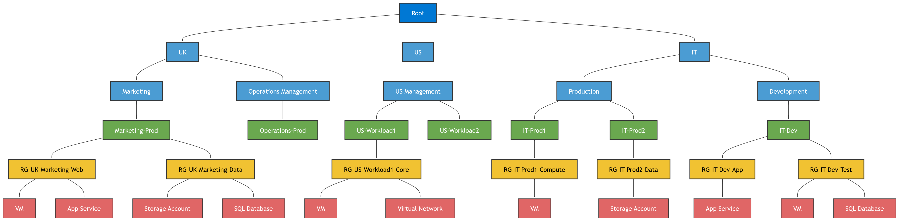

# Azure Resource Hierarchy Explained

---

## ✅ What is the Azure Resource Hierarchy?
The Azure Resource Hierarchy is a way Microsoft Azure organizes resources for **management**, **security**, and **billing**. It helps you structure your cloud environment logically.

---

## 🔹 Key Components in Layman's Terms

### 1. **Tenant**
- Think of a **Tenant** as your **company's Azure account**.
- It represents your organization in Azure Active Directory (Azure AD).
- Every user, group, and identity belongs to a tenant.

**Analogy:** Your company building – everything inside belongs to your company.

---

### 2. **Management Group**
- A **folder** for organizing multiple subscriptions.
- Used for applying policies and governance at scale.
- You can have a hierarchy of management groups (e.g., by region or department).

**Analogy:** Different floors in your company building for departments.

---

### 3. **Subscription**
- A **billing container** for Azure services.
- Defines limits and access control.
- Each subscription is linked to a payment method.

**Analogy:** A department's budget account.

---

### 4. **Resource Group (RG)**
- A **logical container** for related resources.
- Resources in the same RG share lifecycle (create, update, delete together).
- Helps organize resources by application, environment, or function.

**Analogy:** A project folder inside a department.

---

### 5. **Resources**
- The actual **services you use** in Azure (VMs, Storage, Databases, Networks).
- Resources live inside Resource Groups.

**Analogy:** Files inside your project folder.

---

## ✅ How the Diagram Works

The diagram (Azure_Resource_Hierarchy.png) shows:

- **Root (Tenant)** at the top – your organization.
- Under the tenant, **three main branches**:
  - **UK** (Region)
    - Marketing → Subscription: Marketing-Prod → RGs: RG-UK-Marketing-Web, RG-UK-Marketing-Data → Resources like VM, App Service, Storage, SQL DB.
    - Operations Management → Subscription: Operations-Prod (currently no RGs).
  - **US** (Region)
    - US Management → Subscriptions: US-Workload1 (with RG-US-Workload1-Core and resources VM, VNet), US-Workload2 (no RGs yet).
  - **IT** (Function)
    - Production → Subscriptions: IT-Prod1 (RG-IT-Prod1-Compute), IT-Prod2 (RG-IT-Prod2-Data).
    - Development → Subscription: IT-Dev (RG-IT-Dev-App, RG-IT-Dev-Test with resources App Service, VM, SQL DB).

### ✅ Color Coding in Diagram
- **Tenant**: Blue
- **Management Groups**: Light Blue
- **Subscriptions**: Green
- **Resource Groups**: Yellow
- **Resources**: Red

---

## ✅ Why This Matters for AZ-104
- Understanding hierarchy is critical for **access control**, **policy enforcement**, and **cost management**.
- Helps you design scalable and secure environments.

**Tip:** Always plan your hierarchy before deploying resources to avoid chaos later.

---

## ✅ Summary
- Tenant = Your company in Azure.
- Management Groups = Organize subscriptions.
- Subscriptions = Billing and access boundary.
- Resource Groups = Logical containers for resources.
- Resources = Actual services like VMs, Storage, Databases.

